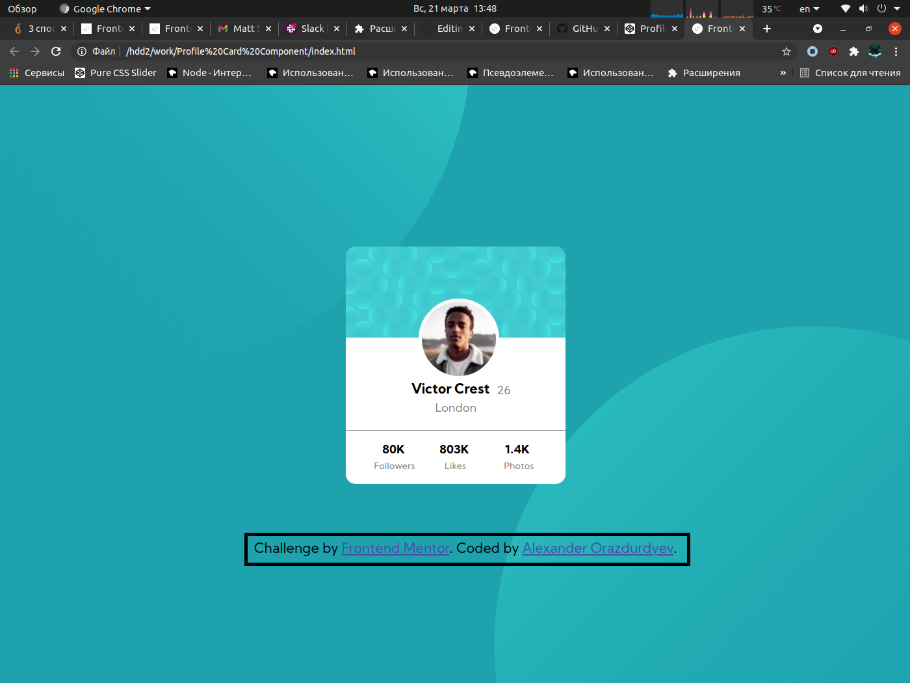

# Profile-Card-Component:
## Overview:
  ### The challenge:
Hello, I am beginner Front-End web developer. I am studying web development. I recently discovered a web site like "Frontend Mentor".
I completed the first their challenge named Profile Card Component.
### Screenshot:

### Links:
Here link to my work on CodePen - [Profile Card Component](https://codepen.io/icewarrior01/full/BaQXGLa)
## My process:
  ### Build with:
Build with HTML and CSS
### What I learned:
I learned about Background Position property and positioning several svg objects on background, absolute positioning, rounding the div block and image using Border Radius, how to make horisontal line without hr tag.
### Continued Development:
I will need to learn responsive design and adapt the site for mobile devices. Now I don't know how to do it yet, but I will try to learn it.
### Useful Resources:
[Habr](https://habr.com/ru/company/netcracker/blog/277433/) - This helped me to learn about positioning blocks
[Indigo](https://idg.net.ua/blog/uchebnik-css/ispolzovanie-css/border-radius) - This helped me to learn about Border Radius
[Webref](https://webref.ru/recipe/2371) - This helped me to make horisontal line
## Author:
[CodePen](https://codepen.io/icewarrior01/full/BaQXGLa)
[Frontend Mentor](https://www.frontendmentor.io/solutions/html-css-xy32zk7s-)
## Acknowledgements:
Thanks for Frontend Mentor, because I need practic for my studies
